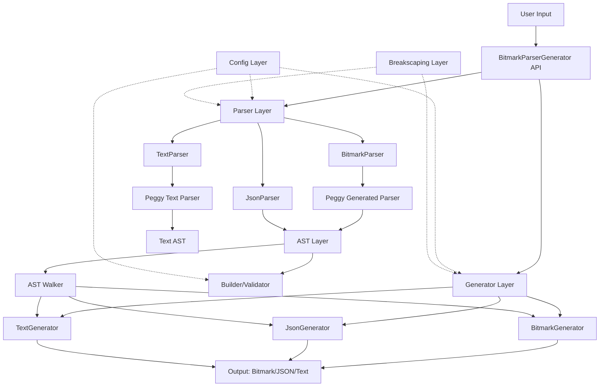
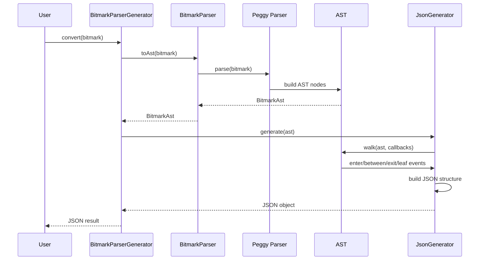
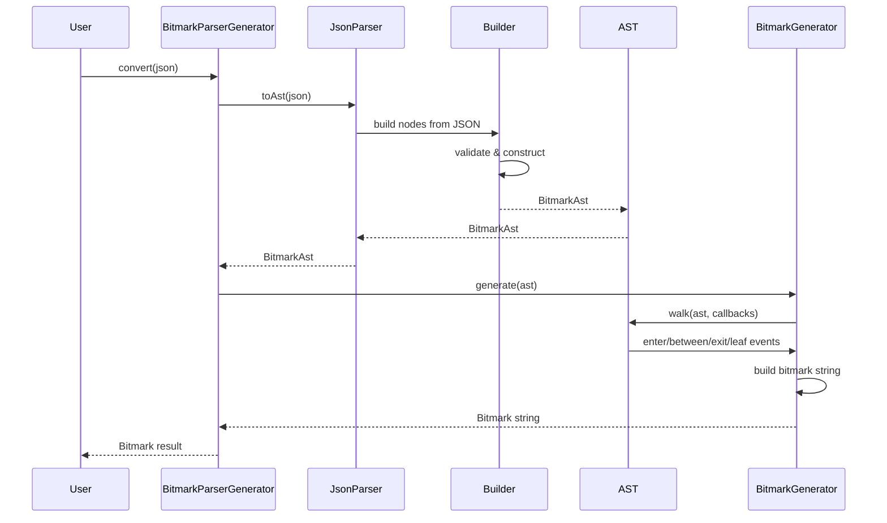
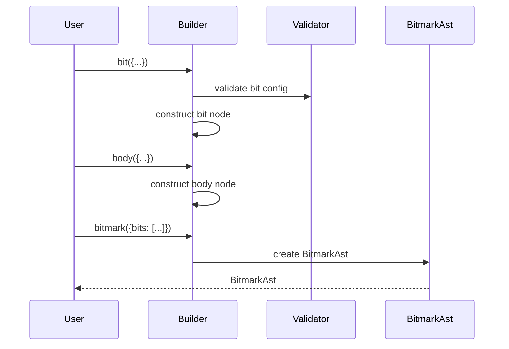

# Bitmark Parser Generator - Architecture

## Table of Contents

- [Bitmark Parser Generator - Architecture](#bitmark-parser-generator---architecture)
  - [Table of Contents](#table-of-contents)
  - [Project Purpose](#project-purpose)
  - [System Overview](#system-overview)
  - [Technology Stack](#technology-stack)
  - [High-Level Architecture](#high-level-architecture)
  - [File-system Structure](#file-system-structure)
  - [Layers / Subsystems](#layers--subsystems)
    - [Grammar Layer](#grammar-layer)
    - [Parser Layer](#parser-layer)
    - [AST Layer](#ast-layer)
    - [Generator Layer](#generator-layer)
    - [Configuration Layer](#configuration-layer)
    - [Model Layer](#model-layer)
    - [Breakscaping Layer](#breakscaping-layer)
  - [Interactions](#interactions)
    - [Bitmark → JSON Conversion Flow](#bitmark--json-conversion-flow)
    - [JSON → Bitmark Conversion Flow](#json--bitmark-conversion-flow)
    - [Programmatic AST Creation](#programmatic-ast-creation)
  - [Rules](#rules)
    - [Performance](#performance)
    - [Scaling](#scaling)
    - [Maintainability](#maintainability)
    - [Security](#security)
    - [Testing](#testing)

## Project Purpose

A bidirectional parser and generator for the bitmark markup language using Peggy.js. Converts between bitmark markup, JSON, and AST (Abstract Syntax Tree) representations. Works in both NodeJS and browser environments with validation, prettification, and programmatic bit creation capabilities.

## System Overview

- **Grammar Layer**: PEG grammar definitions processed by Peggy.js
- **Parser Layer**: Converts bitmark/JSON/text to AST
- **AST Layer**: Central data structure with builders and validators
- **Generator Layer**: Converts AST to bitmark/JSON/text
- **Configuration Layer**: Bit type definitions and validation rules
- **Model Layer**: TypeScript types and enums
- **Breakscaping Layer**: Text escaping for bitmark syntax

## Technology Stack

- **TypeScript 5**: Core language
- **Peggy 5**: PEG parser generator
- **Node 20+**: Runtime (with browser polyfills)
- **Vitest 3**: Testing framework
- **tsup 8**: Build tool (uses esbuild)
- **Webpack 5**: Browser bundle generation

## High-Level Architecture



## File-system Structure

```
/
├── src/                          # Source code
│   ├── BitmarkParserGenerator.ts # Main API entry point
│   ├── index.ts                  # Public exports
│   ├── parser/                   # Parser implementations
│   │   ├── bitmark/              # Bitmark parser (uses Peggy)
│   │   ├── json/                 # JSON parser
│   │   └── text/                 # Text parser (uses Peggy)
│   ├── generator/                # Generator implementations
│   │   ├── bitmark/              # Bitmark generator
│   │   ├── json/                 # JSON generator
│   │   └── text/                 # Text generator
│   ├── ast/                      # AST manipulation
│   │   ├── Ast.ts                # AST walker
│   │   ├── Builder.ts            # AST builder
│   │   ├── ResourceBuilder.ts    # Resource builder
│   │   └── writer/               # Output writers (String/File/Stream)
│   ├── model/                    # Type definitions
│   │   ├── ast/                  # AST node types
│   │   ├── json/                 # JSON types
│   │   ├── enum/                 # Enumerations
│   │   └── config/               # Configuration types
│   ├── config/                   # Bit configuration
│   │   ├── Config.ts             # Config accessor
│   │   └── raw/                  # Configuration data
│   ├── breakscaping/             # Text escaping
│   ├── info/                     # Info/introspection APIs
│   ├── generated/                # Peggy generated parsers
│   └── utils/                    # Utilities
├── assets/                       # Static assets
│   ├── grammar/                  # PEG grammar files
│   │   ├── bitmark/              # Bitmark grammar
│   │   └── text/                 # Text grammar
│   └── config/                   # Configuration definitions
├── scripts/                      # Build scripts
│   └── grammar/                  # Grammar compilation scripts
├── test/                         # Test suites
├── dist/                         # Build output
│   ├── index.js                  # ESM Node build
│   ├── index.cjs                 # CJS Node build
│   └── browser/                  # Browser builds
└── docs/                         # API documentation
```

## Layers / Subsystems

### Grammar Layer

**Location**: `assets/grammar/`, `scripts/grammar/`, `src/generated/`

**Purpose**: Define parsing rules using PEG (Parsing Expression Grammar) syntax, compiled by Peggy.js into executable parsers.

**Key Components**:
- `bit-grammar.pegjs`: Bitmark syntax grammar
- `text-grammar.pegjs`: Text content grammar
- Grammar compilation scripts generate parsers into `src/generated/`

**Rules**:
- Grammars are the source of truth for bitmark syntax
- Generated parsers are committed to repo for browser builds
- Grammar changes require rebuild and full test suite execution

### Parser Layer

**Location**: `src/parser/`

**Purpose**: Convert string inputs (bitmark, JSON, text) into AST representations.

**Key Components**:
- `BitmarkParser`: Wraps Peggy-generated bitmark parser
- `JsonParser`: Parses bitmark JSON format into AST
- `TextParser`: Wraps Peggy-generated text parser
- Parser helpers and processors assist Peggy grammar actions

**Rules**:
- Parsers must not modify input, only transform to AST
- All parsers output to common AST structure
- Parse errors captured in AST, not thrown as exceptions
- Parsers are stateless, no side effects

### AST Layer

**Location**: `src/ast/`, `src/model/ast/`

**Purpose**: Central intermediate representation enabling bidirectional conversion and programmatic manipulation.

**Key Components**:
- `Ast`: AST walker with visitor pattern callbacks
- `Builder`: Programmatic AST construction with validation
- `ResourceBuilder`: Specialized resource node builder
- `NodeValidator`: AST validation rules
- Writers: String/File/Stream output adapters

**Rules**:
- AST is the canonical representation, all conversions go through it
- AST must be serializable (no functions, no circular references)
- Nodes follow strict TypeScript interfaces
- Builder guarantees valid AST construction
- Validation happens at build time, not walk time

### Generator Layer

**Location**: `src/generator/`

**Purpose**: Convert AST to output formats (bitmark, JSON, text).

**Key Components**:
- `AstWalkerGenerator`: Abstract base for generators using AST walker
- `BitmarkGenerator`: AST → Bitmark markup
- `JsonGenerator`: AST → JSON
- `TextGenerator`: AST → Text
- File/String/Object variants for different output targets

**Rules**:
- Generators use AST walker pattern, not direct traversal
- Output must be deterministic for same AST input
- Generators are stateless between invocations
- Support streaming for large outputs (file generators)
- Prettification is optional, controlled by options

### Configuration Layer

**Location**: `src/config/`

**Purpose**: Define all bit types, properties, resources, and validation rules.

**Key Components**:
- `Config`: Central config accessor with caching
- `ConfigHydrator`: Processes raw configs into runtime structures
- `raw/bits.ts`, `raw/groups.ts`: Configuration data
- Bit inheritance tree for shared properties
- Tag/property/resource definitions per bit type

**Rules**:
- Configuration is immutable at runtime
- Bit inheritance: child configs override parent configs
- Config changes require code regeneration
- All bit types must have complete configuration
- Resource types are global, properties are per-bit

### Model Layer

**Location**: `src/model/`

**Purpose**: TypeScript type definitions for all data structures.

**Key Components**:
- `ast/Nodes.ts`: AST node interfaces
- `json/`: JSON format types (BitJson, ResourceJson, etc.)
- `enum/`: Enumerations (BitType, ResourceType, TextFormat, etc.)
- `config/`: Configuration structure types

**Rules**:
- All models are interfaces or types, no runtime logic
- Enums use custom SuperEnum for string-based enums with validation
- JSON types mirror bitmark specification exactly
- AST types are internal, JSON types are external API

### Breakscaping Layer

**Location**: `src/breakscaping/`

**Purpose**: Escape/unescape special bitmark characters in text content.

**Key Components**:
- `Breakscape`: Main API wrapping external implementation
- `BreakscapeRegex`: Regex-based implementation
- Context-aware escaping (body vs tag, bitmark vs plain text)

**Rules**:
- Breakscaping depends on text format and location
- Must be reversible: `unbreakscape(breakscape(x)) === x`
- Performance-critical: used in all parsing/generation
- No external dependencies

**Text Parsing Principle**: Text is always text unless it's a valid bitmark tag.

## Interactions

### Bitmark → JSON Conversion Flow



### JSON → Bitmark Conversion Flow



### Programmatic AST Creation



## Rules

### Performance
- Parsers generate minimal allocations
- AST walker uses single-pass traversal
- Config access cached, not recomputed
- Breakscaping uses optimized regex patterns
- Browser bundle < 60kB minified

### Scaling
- Streaming generators for large documents
- Stateless design enables parallelization
- Config supports unlimited bit types via inheritance
- AST depth limited only by input structure

### Maintainability
- Strict TypeScript with no `any` in public APIs
- Grammar is source of truth, not code
- Config-driven validation, not hardcoded rules
- Comprehensive test coverage for all conversions
- API versioning for breaking changes

### Security
- No eval() or Function() constructor usage
- All inputs validated against schema
- No filesystem access in browser builds
- Parser errors contained, don't crash process

### Testing
- Unit tests for all parsers and generators
- Round-trip tests: `bitmark → AST → bitmark`
- Round-trip tests: `JSON → AST → JSON`
- Cross-format tests: `bitmark → AST → JSON → AST → bitmark`
- Grammar regression tests on grammar changes
- Browser compatibility tests using jsdom
