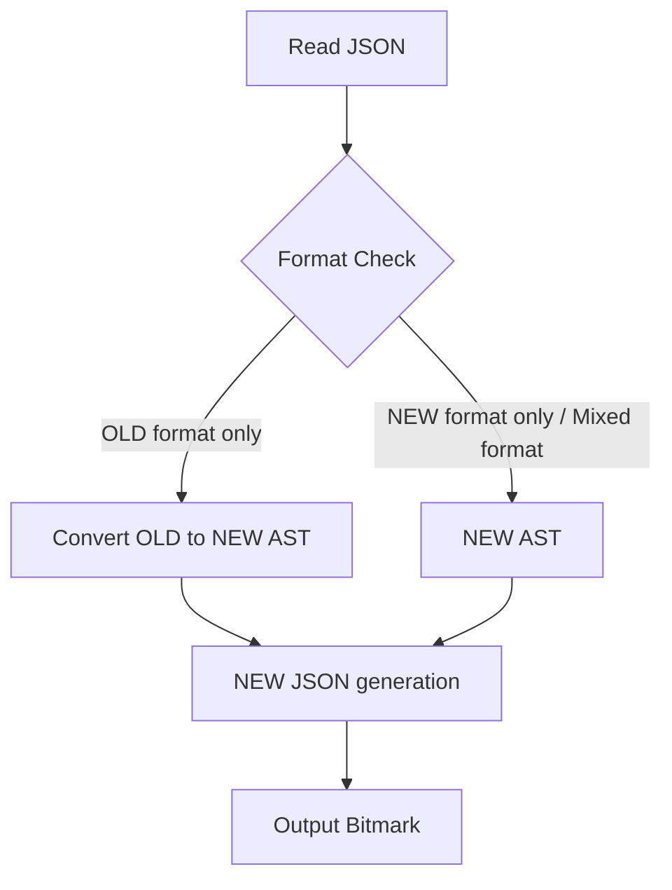

# SPEC: Advanced Bitmark Tables

**Version**: 1.0.0
**Status**: Draft
**Created**: 2025-10-20

## Overview

Add a new `[.table-extended]` bit to support full HTML table semantics including thead, tbody, tfoot, rowspan, colspan, scope, and cell types, while maintaining full backwards compatibility with the current table JSON format.

The enhancement introduces **qualified card dividers** - a generic parser feature enabling special row types within card-like structures. For tables, qualifiers `table-header`, `table-body`, and `table-footer` enable semantic table sections.

## Goals

1. **Full HTML Table Support**: Map bitmark tables 1:1 with HTML table capabilities
2. **Backwards Compatibility**: Existing table JSON and Bitmark must parse and generate correctly as [.table] or [.table-extended]
3. **Generic Card Qualifiers**: Implement qualifiers as a reusable parser feature
4. **Semantic Clarity**: Use standard HTML table terminology and structure
5. **Cell-Level Control**: Support cell properties via tags (rowspan, colspan, scope, cell type)

## Non-Goals

- Visual styling or CSS-related features
- Table data validation beyond structure

---

## Functional Requirements

### 1. Card Divider Qualifiers (Generic Feature)

#### 1.1 Syntax

**Current Bitmark Card Dividers:**
```
====
<content>
--
<content>
++
<content>
====
```

**NEW Qualified Card Dividers:**
```
==== <qualifier> ====
<content>
-- <qualifier> --
<content>
++ <qualifier> ++
<content>
====
```

#### 1.2 Qualifier Rules

- **Position**: Between card divider symbols (`====` or `--` or `++`)
- **Separator**: Exactly 1 space before and after qualifier
- **Format**: Specific qualifiers, usually alphanumeric.
- **Validation**: Unrecognised qualifiers will parse as plain text, Recognized but invalid qualifiers in the context are **ignored** with parser warning (in the BitmarkPegParserValidator)
- **Optional**: Qualifiers are optional; absence means default behavior
- **Scope**: Applies to the card/row following the qualified divider

#### 1.3 Initial Qualifiers for Tables

| Qualifier | Description | HTML Equivalent |
|-----------|-------------|-----------------|
| `table-header` | Table header section | `<thead>` |
| `table-body` | Table body section (default) | `<tbody>` |
| `table-footer` | Table footer section | `<tfoot>` |

#### 1.4 Parser Behavior

```
==== table-header ====     → Starts table header section
<content>
====                → Continues current section (table-body by default)
<content>
==== table-footer ====     → Starts table footer section
<content>
====                → Ends table
```

**Section Transitions:**
- Multiple `table-header` / `table-body` / `table-footer` qualifiers → Allowed, they are merged into blocks when adjacent.
- Interleaved sections → Allowed (e.g., table-header → table-body → table-header → table-body)
- No section qualifier → Defaults to table-body
- Empty sections → Valid (creates empty array 'rows' in JSON)

---

### 2. Table Cell Properties (Per-Cell Tags)

Each cell can have properties defined via tags at the start of cell content:

| Property | Tag | Type | Default | Description |
|----------|-----|------|---------|-------------|
| **Cell Type** | `@tableCellType` | `th` \| `td` | `td` (body), `th` (header/footer) | HTML cell element type |
| **Row Span** | `@tableRowSpan` | integer ≥ 1 | `1` | Number of rows spanned |
| **Col Span** | `@tableColSpan` | integer ≥ 1 | `1` | Number of columns spanned |
| **Scope** | `@tableScope` | `row` \| `col` \| `rowgroup` \| `colgroup` | undefined | Scope for header cells |

#### 2.1 Defaults by Section

| Section | Default Cell Type | Notes |
|---------|-------------------|-------|
| `table-header` | `th` | Header cells |
| `table-body` | `td` | Data cells |
| `table-footer` | `th` | Footer cells (typically totals/notes) |

---

### 3. New JSON Structure

#### 3.1 Enhanced TableJson Interface

```typescript
interface TableJson {
  // LEGACY: Backwards compatible (deprecated but supported)
  columns?: JsonText[];  // Old format: first row as columns
  data?: JsonText[][];   // Old format: remaining rows as data

  // NEW: Semantic table structure
  header?: TableSectionJson;
  body?: TableSectionJson;
  footer?: TableSectionJson;
}

interface TableSectionJson {
  rows: TableRowJson[];
}

interface TableRowJson {
  cells: TableCellJson[];
}

interface TableCellJson {
  content: JsonText;        // Cell content as bitmark text
  title?: boolean;          // true if th, false/undefined if td
  rowspan?: number;         // Omit if 1
  colspan?: number;         // Omit if 1
  scope?: 'row' | 'col' | 'rowgroup' | 'colgroup';
}
```

#### 3.2 Backwards Compatibility

**Old Format (still supported):**
```json
{
  "table": {
    "columns": [["Name"], ["Email"], ["Phone"]],
    "data": [
      [["John"], ["john@example.com"], ["555-1234"]],
      [["Jane"], ["jane@example.com"], ["555-5678"]]
    ]
  }
}
```

**New Format (preferred):**
```json
{
  "table": {
    "head": {
      "rows": [
        {
          "cells": [
            { "content": ["Name"], "title": true },
            { "content": ["Email"], "title": true },
            { "content": ["Phone"], "title": true }
          ]
        }
      ]
    },
    "body": {
      "rows": [
        {
          "cells": [
            { "content": ["John"] },
            { "content": ["john@example.com"] },
            { "content": ["555-1234"] }
          ]
        },
        {
          "cells": [
            { "content": ["Jane"] },
            { "content": ["jane@example.com"] },
            { "content": ["555-5678"] }
          ]
        }
      ]
    }
  }
}
```

#### 3.3 Mixed Format Handling

**Parser (Bitmark → JSON):**
- NEW bitmark (with qualifiers) → NEW JSON format only
- OLD bitmark (no qualifiers) → NEW JSON format (table-body only)

**Generator (JSON → Bitmark):**
- NEW JSON format → NEW bitmark (with qualifiers if header/footer present)
- OLD JSON format → NEW bitmark (auto-convert columns to thead)
- Mixed format (both old and new) → NEW format takes precedence, old format ignored.

---

### 4. Example: Complex Table

#### 4.1 Bitmark

```bitmark
[.table]
[@caption:Sample Quarterly Summary]

==== table-header ====
[@tableRowSpan:2]
[@tableScope:col]
Region
--
[@tableRowSpan:2]
[@tableScope:col]
Area
--
[@tableColSpan:3]
[@tableScope:colgroup]
Q1
--
[@tableRowSpan:2]
[@tableScope:col]
Total

==== table-header ====
[@tableScope:col]
Jan
--
[@tableScope:col]
Feb
--
[@tableScope:col]
Mar

====
[@tableCellType:th]
[@tableRowSpan:2]
[@tableScope:row]
West
--
Coastal
--
10
--
12
--
11
--
33

====
Inland
--
8
--
9
--
7
--
24

====
[@tableCellType:th]
[@tableScope:row]
North
--
(all)
--
14
--
13
--
12
--
39

====
[@tableCellType:th]
[@tableScope:row]
South
--
(all)
--
6
--
7
--
8
--
21

==== table-footer ====
[@tableCellType:th]
[@tableColSpan:5]
[@tableScope:row]
Grand total
--
117

==== table-footer ====
[@tableColSpan:6]
Note: values are example numbers.

====
```

#### 4.2 JSON Output

```json
{
  "type": "table",
  "format": "bitmark++",
  "bitLevel": 1,
  "caption": [{"type": "paragraph", "content": [{"text": "Sample Quarterly Summary", "type": "text"}], "attrs": {}}],
  "table": {
    "header": {
      "rows": [
        {
          "cells": [
            {
              "content": [{"type": "paragraph", "content": [{"text": "Region", "type": "text"}], "attrs": {}}],
              "title": true,
              "rowspan": 2,
              "scope": "col"
            },
            {
              "content": [{"type": "paragraph", "content": [{"text": "Area", "type": "text"}], "attrs": {}}],
              "title": true,
              "rowspan": 2,
              "scope": "col"
            },
            {
              "content": [{"type": "paragraph", "content": [{"text": "Q1", "type": "text"}], "attrs": {}}],
              "title": true,
              "colspan": 3,
              "scope": "colgroup"
            },
            {
              "content": [{"type": "paragraph", "content": [{"text": "Total", "type": "text"}], "attrs": {}}],
              "title": true,
              "rowspan": 2,
              "scope": "col"
            }
          ]
        },
        {
          "cells": [
            {
              "content": [{"type": "paragraph", "content": [{"text": "Jan", "type": "text"}], "attrs": {}}],
              "title": true,
              "scope": "col"
            },
            {
              "content": [{"type": "paragraph", "content": [{"text": "Feb", "type": "text"}], "attrs": {}}],
              "title": true,
              "scope": "col"
            },
            {
              "content": [{"type": "paragraph", "content": [{"text": "Mar", "type": "text"}], "attrs": {}}],
              "title": true,
              "scope": "col"
            }
          ]
        }
      ]
    },
    "body": {
      "rows": [
        {
          "cells": [
            {
              "content": [{"type": "paragraph", "content": [{"text": "West", "type": "text"}], "attrs": {}}],
              "title": true,
              "rowspan": 2,
              "scope": "row"
            },
            {"content": [{"type": "paragraph", "content": [{"text": "Coastal", "type": "text"}], "attrs": {}}]},
            {"content": [{"type": "paragraph", "content": [{"text": "10", "type": "text"}], "attrs": {}}]},
            {"content": [{"type": "paragraph", "content": [{"text": "12", "type": "text"}], "attrs": {}}]},
            {"content": [{"type": "paragraph", "content": [{"text": "11", "type": "text"}], "attrs": {}}]},
            {"content": [{"type": "paragraph", "content": [{"text": "33", "type": "text"}], "attrs": {}}]}
          ]
        },
        {
          "cells": [
            {"content": [{"type": "paragraph", "content": [{"text": "Inland", "type": "text"}], "attrs": {}}]},
            {"content": [{"type": "paragraph", "content": [{"text": "8", "type": "text"}], "attrs": {}}]},
            {"content": [{"type": "paragraph", "content": [{"text": "9", "type": "text"}], "attrs": {}}]},
            {"content": [{"type": "paragraph", "content": [{"text": "7", "type": "text"}], "attrs": {}}]},
            {"content": [{"type": "paragraph", "content": [{"text": "24", "type": "text"}], "attrs": {}}]}
          ]
        },
        {
          "cells": [
            {
              "content": [{"type": "paragraph", "content": [{"text": "North", "type": "text"}], "attrs": {}}],
              "title": true,
              "scope": "row"
            },
            {"content": [{"type": "paragraph", "content": [{"text": "(all)", "type": "text"}], "attrs": {}}]},
            {"content": [{"type": "paragraph", "content": [{"text": "14", "type": "text"}], "attrs": {}}]},
            {"content": [{"type": "paragraph", "content": [{"text": "13", "type": "text"}], "attrs": {}}]},
            {"content": [{"type": "paragraph", "content": [{"text": "12", "type": "text"}], "attrs": {}}]},
            {"content": [{"type": "paragraph", "content": [{"text": "39", "type": "text"}], "attrs": {}}]}
          ]
        },
        {
          "cells": [
            {
              "content": [{"type": "paragraph", "content": [{"text": "South", "type": "text"}], "attrs": {}}],
              "title": true,
              "scope": "row"
            },
            {"content": [{"type": "paragraph", "content": [{"text": "(all)", "type": "text"}], "attrs": {}}]},
            {"content": [{"type": "paragraph", "content": [{"text": "6", "type": "text"}], "attrs": {}}]},
            {"content": [{"type": "paragraph", "content": [{"text": "7", "type": "text"}], "attrs": {}}]},
            {"content": [{"type": "paragraph", "content": [{"text": "8", "type": "text"}], "attrs": {}}]},
            {"content": [{"type": "paragraph", "content": [{"text": "21", "type": "text"}], "attrs": {}}]}
          ]
        }
      ]
    },
    "footer": {
      "rows": [
        {
          "cells": [
            {
              "content": [{"type": "paragraph", "content": [{"text": "Grand total", "type": "text"}], "attrs": {}}],
              "title": true,
              "colspan": 5,
              "scope": "row"
            },
            {"content": [{"type": "paragraph", "content": [{"text": "117", "type": "text"}], "attrs": {}}]}
          ]
        },
        {
          "cells": [
            {
              "content": [{"type": "paragraph", "content": [{"text": "Note: values are example numbers.", "type": "text"}], "attrs": {}}],
              "colspan": 6
            }
          ]
        }
      ]
    }
  }
}
```

#### 4.3 HTML Equivalent

```html
<table border="1">
  <caption>Sample Quarterly Summary</caption>

  <thead>
    <tr>
      <th scope="col" rowspan="2">Region</th>
      <th scope="col" rowspan="2">Area</th>
      <th scope="colgroup" colspan="3">Q1</th>
      <th scope="col" rowspan="2">Total</th>
    </tr>
    <tr>
      <th scope="col">Jan</th>
      <th scope="col">Feb</th>
      <th scope="col">Mar</th>
    </tr>
  </thead>

  <tbody>
    <tr>
      <th scope="row" rowspan="2">West</th>
      <td>Coastal</td>
      <td>10</td>
      <td>12</td>
      <td>11</td>
      <td>33</td>
    </tr>
    <tr>
      <td>Inland</td>
      <td>8</td>
      <td>9</td>
      <td>7</td>
      <td>24</td>
    </tr>
    <tr>
      <th scope="row">North</th>
      <td>(all)</td>
      <td>14</td>
      <td>13</td>
      <td>12</td>
      <td>39</td>
    </tr>
    <tr>
      <th scope="row">South</th>
      <td>(all)</td>
      <td>6</td>
      <td>7</td>
      <td>8</td>
      <td>21</td>
    </tr>
  </tbody>

  <tfoot>
    <tr>
      <th scope="row" colspan="5">Grand total</th>
      <td>117</td>
    </tr>
    <tr>
      <td colspan="6">Note: values are example numbers.</td>
    </tr>
  </tfoot>
</table>
```

---

### 5. Migration Strategy

#### 5.1 Parser Migration (Bitmark → JSON)

- Only new format in AST
- Has old [#title] format -> this row becomes `table-header` / `td`
- Always output new format

**Old Format Detection:**
- Only `[#title]` support is necessary, and it can be supported in the new format as well. → Convert to `table-header` / `td`
- Therefore no special detection necessary

#### 5.2 Generator Migration (JSON → Bitmark)



**Old → New Conversion:**

(only if new table data does not exist)

```typescript
function convertOldToNew(oldTable: OldTableJson): NewTableJson {
  return {
    header: oldTable.columns ? {
      rows: [{
        cells: oldTable.columns.map(col => ({
          content: col,
          title: true
        }))
      }]
    } : undefined,
    body: oldTable.data ? {
      rows: oldTable.data.map(row => ({
        cells: row.map(cell => ({
          content: cell
        }))
      }))
    } : undefined
  };
}
```

---

## Non-Functional Requirements

### Performance

None.

### Validation

| Rule | Error Type | Action |
|------|------------|--------|
| Unknown qualifier | Warning | Ignore qualifier, treat as unqualified |
| Invalid tag value | Warning | Use default value |
| Invalid rowspan/colspan | Warning | Clamp to valid range (≥1) |
| Invalid scope | Warning | Omit scope attribute |

### Compatibility

- **Bitmark**: Fully backwards compatible
- **JSON Schema**: Both OLD and NEW formats supported - NEW superceeds old

---

## Data Structures

### AST Extensions

```typescript
// NEW: Card data with optional qualifier
export interface CardData {
  cardIndex: number;
  cardSideIndex: number;
  cardVariantIndex: number;
  value: string;
  qualifier?: string;  // NEW: 'table-header' | 'table-body' | 'table-footer' | custom
}

// NEW: Table cell AST
interface TableCell {
  content: JsonText;
  cellType?: 'th' | 'td';
  rowspan?: number;
  colspan?: number;
  scope?: 'row' | 'col' | 'rowgroup' | 'colgroup';
}
```

---

## Edge Cases

### 1. Empty Sections

```bitmark
==== table-header ====
====
```
→ Creates empty `header.rows[0].cells = []` in JSON

### 2. Multiple Qualifiers Same Section

```bitmark
==== table-header ====
Row 1
==== table-header ====
Row 2
====
```
→ Creates `header.rows[0].cells = [{ "content": "Row 1" }]` in JSON
→ Creates `header.rows[1].cells = [{ "content": "Row 2" }]` in JSON

### 3. Qualifier with Whitespace Variations

```bitmark
====table-header====       → Error: No spaces -> Parsed as body/card text
====  table-header  ====   → Error: Multiple spaces -> Parsed as body/card text
==== table-header====      → Error: Missing trailing space -> Parsed as body/card text
```
→ Parser must enforce exactly 1 space before and after

### 4. Cell Spanning Across Sections

```bitmark
==== table-header ====
[@tableRowSpan:2]
Header
====
[@tableCellType:td]
Body Cell
====
```
→ Warning: rowspan crosses section boundary. Renderer may clip.

### 5. Legacy JSON with New Bitmark

**Input (OLD JSON):**
```json
{"columns": [["A"], ["B"]], "data": [[["1"], ["2"]]]}
```

**Output (NEW Bitmark):**
```bitmark
==== table-header ====
A
--
B
====
1
--
2
====
```

---

## Testing Strategy

### Unit Tests

1. **Qualifier Parsing**
   - Valid qualifiers (table-header, table-body, table-footer)
   - Invalid qualifiers (warning)
   - Whitespace variations (errors)
   - Missing qualifiers (default behavior)

2. **Cell Property Tags**
   - All tag types (cellType, rowspan, colspan, scope)
   - Invalid values (warnings, defaults)
   - Missing tags (defaults)
   - Tag ordering

3. **JSON Conversion**
   - OLD → NEW format conversion
   - NEW → OLD format (not supported, warning)
   - Mixed format handling

### Integration Tests

1. **Round-trip Tests**
   - NEW Bitmark → JSON → Bitmark (preserve qualifiers)
   - OLD Bitmark → JSON → NEW Bitmark (auto-upgrade)
   - OLD JSON → Bitmark → JSON (preserve OLD format)

2. **Complex Tables**
   - Multi-row headers (example table)
   - Mixed cell types in table-body
   - Empty sections
   - Maximum nesting depth

### Regression Tests

- All existing table tests must pass
- OLD format must continue to work

---

## Implementation Notes

### Peggy Grammar Changes

Ensure existing behaviours not broken - this is HARD - see [Compatibility](#compatibility-1)!

### Parser Processor

```typescript
// CardContentProcessor.ts
function parseTableWithSections(
  context: BitmarkPegParserContext,
  bitType: BitTypeType,
  cardSet: ProcessedCardSet,
): BitSpecificCards {
  const sections: Map<string, TableRowJson[]> = new Map([
    ['table-header', []],
    ['table-body', []],
    ['table-footer', []]
  ]);

  let currentSection = 'table-body'; // Default

  for (const card of cardSet.cards) {
    const qualifier = card.qualifier;

    if (qualifier) {
      if (!sections.has(qualifier)) {
        context.addWarning(`Unknown table section qualifier: ${qualifier}`);
      } else {
        currentSection = qualifier;
      }
    }

    const row = parseTableRow(card);
    sections.get(currentSection)!.push(row);
  }

  return {
    table: {
      head: sections.get('table-header')!.length > 0 ? { rows: sections.get('table-header')! } : undefined,
      body: sections.get('table-body')!.length > 0 ? { rows: sections.get('table-body')! } : undefined,
      foot: sections.get('table-footer')!.length > 0 ? { rows: sections.get('table-footer')! } : undefined,
    }
  };
}
```

---

## Compatibility

### Card Divider Support

The qualified card divider feature must maintain **full backwards compatibility** with all existing card divider syntaxes used throughout bitmark.

#### Existing Card Divider Types

| Version | Dividers | Description | Example Bits |
|---------|----------|-------------|--------------|
| **V1 (Legacy)** | `===` / `==` / `--` | Original card syntax, auto-closes | flashcard, match, cloze |
| **V2 (Modern)** | `====` / `--` / `++` | Current card syntax, explicit close | interview, gap-text, pairs |
| **Special: Footer** | `~~~~` or `==== footer ====` | Footer divider (ends body) | All bits with footer |
| **Special: Plain Text** | `$$$$` or `==== text ====` | Plain text block divider | All bits with plain text |

#### Qualified Divider Compatibility Matrix

| Divider Syntax | Can Have Qualifier? | Notes |
|----------------|---------------------|-------|
| `====` | **YES** | `==== qualifier ====` - Primary use case |
| `--` | **YES** | `-- qualifier --` - Cell dividers |
| `++` | **YES** | `++ qualifier ++` - Alternative cell dividers |
| `===` (V1) | **NO** | Legacy syntax, no qualifiers |
| `==` (V1) | **NO** | Legacy syntax, no qualifiers |
| `~~~~` | **NO** | Special footer divider, no qualifiers |
| `$$$$` | **NO** | Special plain text divider, no qualifiers |
| `==== footer ====` | **NO** (reserved) | Already qualified as footer |
| `==== text ====` | **NO** (reserved) | Already qualified as text/plain text |

#### Grammar Rules

**V2 Card Divider with Optional Qualifier:**
```pegjs
CardDivider_V2
  = "====" WS+ qualifier:Qualifier WS+ "====" { return { type: 'card', version: 2, qualifier }; }
  / "====" (WNL / WEOL) { return { type: 'card', version: 2, qualifier: null }; }
  / "--" WS+ qualifier:Qualifier WS+ "--" { return { type: 'cell', qualifier }; }
  / "--" (WNL / WEOL) { return { type: 'cell', qualifier: null }; }
  / "++" WS+ qualifier:Qualifier WS+ "++" { return { type: 'cell', qualifier }; }
  / "++" (WNL / WEOL) { return { type: 'cell', qualifier: null }; }

Qualifier
  = !("footer" / "text") qualifier:("[a-z][a-z0-9-]*") { return qualifier; }
```

**V1 Card Divider (No Qualifiers):**
```pegjs
CardDivider_V1
  = "===" (WNL / WEOL) { return { type: 'card', version: 1, qualifier: null }; }
  / "==" (WNL / WEOL) { return { type: 'card', version: 1, qualifier: null }; }
  / "--" (WNL / WEOL) { return { type: 'cell', qualifier: null }; }
```

**Special Dividers (Reserved):**
```pegjs
FooterDivider
  = "~~~~" (WNL / WEOL) { return { type: 'footer' }; }
  / "====" WS+ "footer" WS+ "====" (WNL / WEOL) { return { type: 'footer' }; }

PlainTextDivider
  = "$$$$" (WNL / WEOL) { return { type: 'plaintext' }; }
  / "====" WS+ "text" WS+ "====" (WNL / WEOL) { return { type: 'plaintext' }; }
```

#### Backwards Compatibility Rules

1. **V1 Bits Unchanged**: Bits using `===` / `==` / `--` continue to work exactly as before
2. **V2 Bits Extended**: Bits using `====` / `--` / `++` can now optionally use qualifiers
3. **Special Dividers Protected**: `footer` and `text` are reserved qualifiers and cannot be used for custom purposes
4. **Parser Priority**: Special dividers (`~~~~`, `$$$$`) are matched before qualified dividers to prevent ambiguity
5. **Whitespace Required**: Qualifiers MUST have exactly 1 space before and after to distinguish from content

#### Examples

**Valid Qualified Dividers:**
```bitmark
==== table-header ====       ✓ V2 with qualifier
-- table-body --           ✓ Cell with qualifier
++ table-footer ++           ✓ Alternative cell with qualifier
====                  ✓ V2 without qualifier (default)
--                    ✓ Cell without qualifier (default)
```

**Invalid/Reserved Patterns:**
```bitmark
==== footer ====      ✗ Reserved (footer divider)
==== text ====        ✗ Reserved (plain text divider)
=== table-header ===         ✗ V1 cannot have qualifiers
====table-header====         ✗ Missing required spaces
==== table-header====        ✗ Missing trailing space
====  table-header  ====     ✗ Multiple spaces not allowed
```

**Legacy Compatibility:**
```bitmark
[.flashcard]          ✓ V1 bit, no qualifiers needed
===
Front
===
Back
===

[.interview]          ✓ V2 bit, qualifiers optional
====
Question 1
--
Answer 1
====
```

#### Migration Path

**Phase 1: Current State**
- All existing card dividers work as-is
- No qualifiers in use

**Phase 2: Qualification Support (This Spec)**
- V2 dividers (`====`, `--`, `++`) support qualifiers
- V1 dividers (`===`, `==`) remain unchanged
- Special dividers (`~~~~`, `$$$$`, footer, text) remain unchanged
- Backwards compatible: existing bits parse identically

**Phase 3: Future Extensions**
- New qualifiers can be added (e.g., `colgroup`, `caption`)
- Additional bits can adopt qualified dividers
- V1 syntax remains supported indefinitely

#### Bit-Specific Behavior

| Bit Type | Card Version | Qualifier Support | Notes |
|----------|--------------|-------------------|-------|
| `table` | V2 | **YES** (table-header/table-body/table-footer) | Primary use case |
| `pronunciation-table` | V2 | **NO** | Different structure, not applicable |
| `interview` | V2 | **NO** | Not applicable to this bit type |
| `flashcard` | V1/V2 | **NO** (V1), **FUTURE** (V2) | Could be extended in future |
| `match` | V2 | **NO** | Not applicable to this bit type |
| `cloze` | V2 | **NO** | Not applicable to this bit type |
| `gap-text` | V2 | **NO** | Not applicable to this bit type |
| `pairs` | V2 | **NO** | Not applicable to this bit type |

### Qualifier Validation

Qualifiers are validated at the **processor level** (not parser level) to allow for bit-specific behavior:

```typescript
// BitmarkPegParserValidator.ts
function validateQualifier(
  qualifier: string | null,
  bitType: BitTypeType,
  context: ValidationContext
): void {
  if (!qualifier) return; // No qualifier is always valid

  const validQualifiers = getValidQualifiersForBitType(bitType);

  if (!validQualifiers.includes(qualifier)) {
    context.addWarning(
      `Qualifier '${qualifier}' is not valid for bit type '${bitType}'. ` +
      `Valid qualifiers: ${validQualifiers.join(', ')}`
    );
  }
}

function getValidQualifiersForBitType(bitType: BitTypeType): string[] {
  switch (bitType) {
    case BitType.table:
    case BitType.tableAlt:
    case BitType.standardTableNormative:
    case BitType.standardTableNonNormative:
    case BitType.standardRemarkTableNormative:
    case BitType.standardRemarkTableNonNormative:
      return ['table-header', 'table-body', 'table-footer'];

    // Future: Other bits can define their own valid qualifiers
    // case BitType.article:
    //   return ['section', 'aside', 'nav'];

    default:
      return []; // No qualifiers supported
  }
}
```

---

## Design Decisions

### 1. Custom Qualifiers Beyond table-header/table-body/table-footer

**Decision**: ✅ **APPROVED** - Allow but warn for unknown qualifiers

- Parser accepts any valid qualifier syntax
- Processor validates against bit-specific allowed qualifiers
- Unknown qualifiers trigger warnings but do not fail parsing
- Enables future extensions (e.g., `colgroup`, `caption`, custom sections)
- Maintains forward compatibility

### 2. Malformed Cell Spanning

**Decision**: ✅ **APPROVED** - Validate and warn, but don't reject

- Parser accepts rowspan/colspan values
- Processor validates (≥1, warns if invalid, clamps to valid range)
- Invalid values use defaults (rowspan=1, colspan=1)
- **Renderer NOT responsible for validation** - processor handles all validation
- Ensures consistent behavior across all renderers

### 3. OLD Format Deprecation

**Decision**: ✅ **APPROVED** - Support indefinitely for backwards compatibility

- Both OLD and NEW JSON formats supported forever
- Parser outputs NEW format for all inputs
- Generator accepts both formats (NEW preferred, OLD auto-converted)
- Documentation recommends NEW format for new content
- No breaking changes for existing content

### 4. Cell Content with Card-like Syntax

**Decision**: ✅ **RESOLVED** - No special handling needed

**Principle**: Text is always text unless it's a valid bitmark construct at the start of a line.

- `====` (and other dividers) are only recognized at the **start of a line**
- Mid-line or indented `====` is always treated as text content
- If `====` at start of line is NOT valid in context → already treated as text
- If `====` at start of line IS valid but text is desired → breakscape it
- **No special parsing logic needed** - existing bitmark text parsing rules apply

**Examples**:
```bitmark
[.table]
====
This ====text==== is safe    ← Mid-line `====` = text
--
Also safe:
  ====                        ← Indented = text
--
To include literal divider:
\[====]                       ← Breakscaped = text as `====`
====
```

---

## References

- [HTML Table Spec (MDN)](https://developer.mozilla.org/en-US/docs/Web/HTML/Element/table)
- [WCAG Table Accessibility](https://www.w3.org/WAI/tutorials/tables/)
- Architecture: `/specs/ARCHITECTURE.md`
- Current Table Config: `/src/config/raw/bits.ts` (line 4423)
- Current Table Parser: `/src/parser/bitmark/peg/contentProcessors/CardContentProcessor.ts` (line 903)
- Current Table JSON: `/src/model/json/BitJson.ts` (line 463)

---

## Glossary

- **Qualifier**: Keyword between card divider symbols specifying row/section type
- **Cell Property**: Attribute of a table cell (rowspan, colspan, scope, type)
- **Section**: Semantic grouping of table rows (table-header, table-body, table-footer)
- **Legacy/OLD Format**: Original table JSON structure with `columns` and `data` arrays
- **NEW Format**: Enhanced table JSON structure with `header`, `body`, `footer` sections
